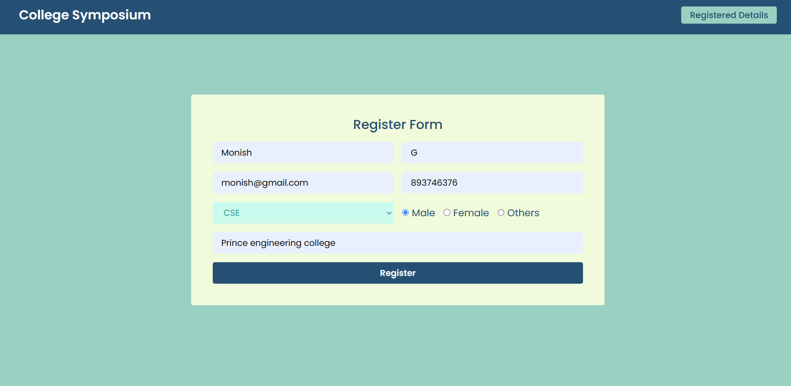
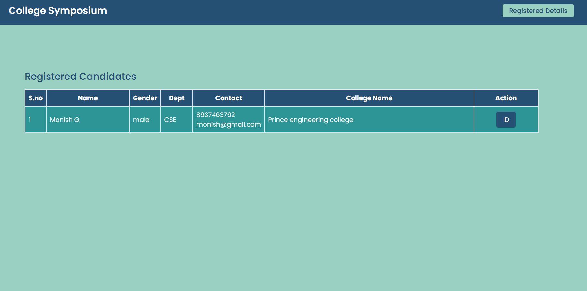

# Symposium Registration System

This is a simple Symposium Registration System where candidates can register for the symposium and view their digital ID.

## Live-Link
> https://san1234100.github.io/symposium-registration/

## Screenshots
- **ScreenShot1**

- **ScreenShot2**

- **ScreenShot2**


## Features

- Register Candidates: Users can register for the symposium by providing their information.
- View Registered Candidates: There's a page where registered candidates can view their information.
- Digital ID Generation: Registered candidates can view and download their digital ID.

## Technologies Used

- HTML: For structuring the web pages.
- Tailwind CSS: For styling the UI components.
- JavaScript: For interactivity and dynamic content.
- JS DOM: For manipulating the HTML elements.
- Local Storage: For storing registered candidates's information locally.

## Usage

1. Clone the repository:

   ```bash
   git clone https://github.com/san1234100/symposium-registration.git
## Installation
To install Tailwind CSS, you can follow these steps:
```bash
npm run dev
```
## Contributing
Contributions are welcome! Feel free to open issues or submit pull requests with improvements or additional features.

## License
- [MIT]("./license")

# Happy coding!😁🧑‍💻